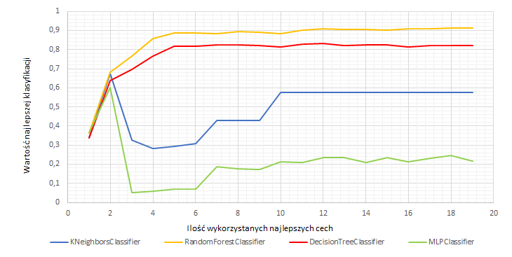

# Opis działania programu rozpoznającego liście na obrazach
## Wymagania
Program został napisany w języku programowania Python v3.5.2. Do swojego poprawnego działania wymaga zainstalowanych bibliotek NumPy v1.12.1 oraz scikit-image v0.14. Program przyjmuje dwa argumenty: ścieżkę do katalogu z bazą obrazów liści oraz nazwę pliku wynikowego. Jeżeli nazwa pliku wynikowego nie zostanie podana, to wyliczone cechy zostaną zapisane w pliku o domyślnej nazwie ‘output.csv’.

<code>python3 leafFeatureIdentification.py leafsnap-subset1/ output.csv</code> 

<small><b>Ryc. 1.</b> Przykład poprawnego uruchomienia programu.</small>

## Detekcja liścia

W pierwszym etapie działania funkcji _leaf_detection_ analizowany obraz najpierw zmieniany jest za pomocą funkcji _color.rgb2gray_ ze zdjęcia wielobarwnego na skalę szarości, następnie obraz progowany jest w celu usunięcia pikseli tła, z wykorzystaniem funkcji _filters.threshold_mean_ z biblioteki _skimage_. Funkcja ta oblicza wartość progowania na podstawie średniej jasności pikseli. Kolejnym krokiem jest etykietyzacja obrazu (_measure.label_ z biblioteki _skimage_) oraz usunięcie obszarów zawierających się w odległości dziesięciu procent (wysokości/długości obrazu) od dolnej lub prawej krawędzi. Zabieg ten powoduje usunięcie skali, która mogłaby utrudnić rozpoznanie liścia. Po renumeracji etykiet następuje obliczenie pola powierzchni i odległości od środka obrazu danych obszarów. Obliczone wartości są normalizowane - największa wartość pola powierzchni oraz najmniejsza odległość od środka przyjmują wartość 1. Następnie dla każdego obszaru odpowiadające mu wartości są sumowane i jako liść uznawany jest obszar o największej sumie powyższych elementów. Normalizacja oraz wybór odpowiedniej etykiety przeprowadzane są w funkcji _leaf_label_identification_, która jako wynik zwraca obraz zawierający domniemany liść (jasność pikseli liścia równa 255, natomiast tła - 0).

## Ekstrakcja cech liścia z obrazów

Wszystkie funkcje wykorzystywane do detekcji cech liścia pochodzą z biblioteki _skimage_, a dokładniej z modułu _measure.regionprops_. Cechy wybrane do charakteryzacji liścia to:
<ol>
<li>area - liczba pikseli obrazu liścia;</li>
<li>bbox area - liczba pikseli bryły brzegowej;</li>
<li>perimeter - wielkość obwodu liścia;</li>
<li>convex area - ilość pikseli najmniejszego zbioru wypukłego zawierającego obraz liścia;</li>
<li>ecceentricity - stosunek odległości ogniskowej (odległość między punktami ogniskowymi) do osi głównej;</li>
<li>eqivalent diameter - średnica okręgu o tym samym obszarze co obraz liścia;</li>
<li>extent - stosunek pikseli obrazu rośliny do liczby pikseli bryły brzegowej;</li>
<li>major axis length - długość osi głównej elipsy, która ma tą samą wartość znormalizowaną drugiego momentu centralnego co obraz liścia;</li>
<li>minor axis length - długość osi mniejszej elipsy, która ma tą samą wartość znormalizowaną drugiego momentu centralnego co obraz liścia;</li>
<li>solidity - stosunek ilości pikseli obrazu liścia do ilości pikseli najmniejszego zbioru wypukłego zawierającego obraz;</li>
<li>area_ratio - stosunek pola powierzchni liścia po erozji do pola powierzchni liścia przed erozją;</li>
<li>perimeter_ratio - stosunek obwodu liścia po erozji do pola powierzchni liścia przed erozją;</li>
<li>number_of_objects - liczba obszarów na jakie podzielił się liść po erozji.</li></ol>

Trzy ostatnie cechy obliczane są dla 3 różnych parametrów erozji.
  

# Wybór i uczenie klasyfikatorów

## Wymagania

Program klasyfikujący liście poza wyróżnionymi w punkcie pierwszym pakietów, wymaga dodatkowo zainstalowanej biblioteki scikit-learn v0.18.1. Program przyjmuje jeden argument: - ścieżkę do katalogu z bazą obrazów liści (rozszerzenie .jpg). Program na wyjściu wypisuje dla każdego pliku jego nazwę oraz przewidziany gatunek liścia.

<code>python3 leafClassification.py leafsnap-subset1/</code> 
<small><b>Ryc. 2.</b> Przykład poprawnego uruchomienia programu klasyfikującego liście.</small>

<code><pre>ny1079-04-4.jpg acer_campestre
wb1448-06-3.jpg ginkgo_biloba
wb1001-08-3.jpg fagus_grandifolia
pi0056-06-3.jpg ilex_opaca
pi0046-03-3.jpg carya_glabra</pre></code> 

<small><b>Ryc. 3.</b> Przykładowe wyniki zwracane przez program klasyfikujący liście.</small>

## Wybór i uczenie klasyfikatorów

Wśród dostępnych klasyfikatorów w ramach pakietu _scikit-learn_ wybrano:

<ol><li>KNeighborsClassifier - klasyfikacja przynależności na podstawie najbliższego sąsiedztwa;</li>
<li>RandomForestClassifier - klasyfikacja przynależności na podstawie losowego zestawu danych (cech) z których tworzone są zdekolerowane drzewa decyzyjne;</li>
<li>DecisionTreeClassifier - klasyfikacja przynależności na podstawie drzewa decyzyjnego bazującego na zestawie danych (cech);</li>
<li>MLPClassifier - klasyfikacja przynależności za pomocą sieci neuronowych.</li></ol>

<small><b>Ryc. 4.</b> Wykres pokazujący zmianę wartości najlepszej klasyfikacji w zależności od ilości najkorzystniejszych cech wybranych w oparciu o wartość ANOVA F-value.</small>

Po wykonanych testach najlepszym klasyfikatorem okazał się klasyfikator lasu losowego (_RandomForestClassifier_)  dla przetestowanych parametrów:
- warm_start_ - False;
- min_samples_leaf_ -  1;
- max_features_ -  log2;
- min_samples_split_ -  2;
- bootstrap_ -  False;
- n_estimators_ -  27.

Pozostałe parametry przyjmowały wartości domyślne. Klasyfikator wykorzystuje wszystkie dostępne dane.

